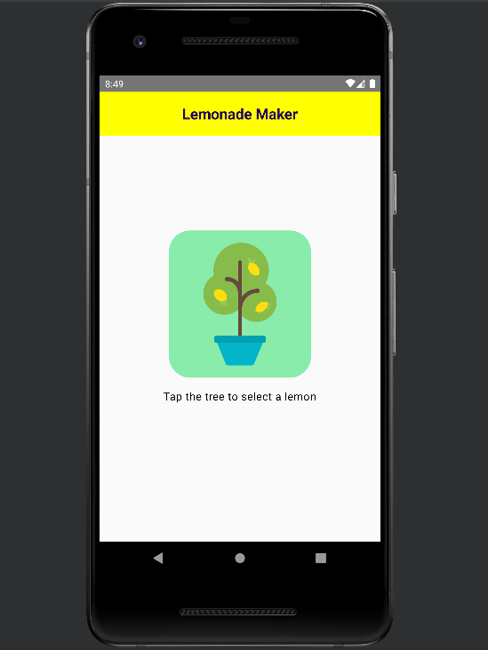
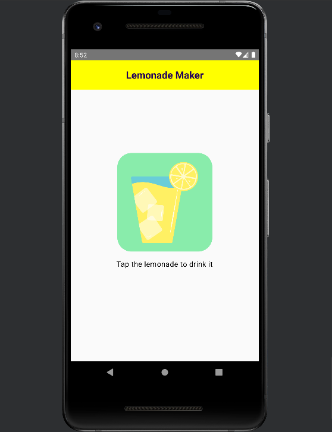

# Lemonade Maker
### Description
A simple, interactive app that lets you juice lemons when you tap the image on screen until you have a glass of lemonade.

### Features
- Juice lemons by tapping on the screen.
- Clean and intuitive user interface built with Jetpack Compose.

### Requirements
Android device running Android 8.1 (Oreo) or above.

### Screenshots



### Installation
1. Install the latest version of Android Studio on your machine.
2. Clone the repository:
```bash
git clone https://github.com/andrograf/Dice-Roller.git
```
3. Open Android Studio and select "Open an existing project."
4. Navigate to the cloned repository and open it.
5. Wait for the Gradle sync to finish and build the project.
6. Connect your Android device to the development machine or use a virtual device.
7. Click on the "Run" button in Android Studio to build and install the app on your device.
